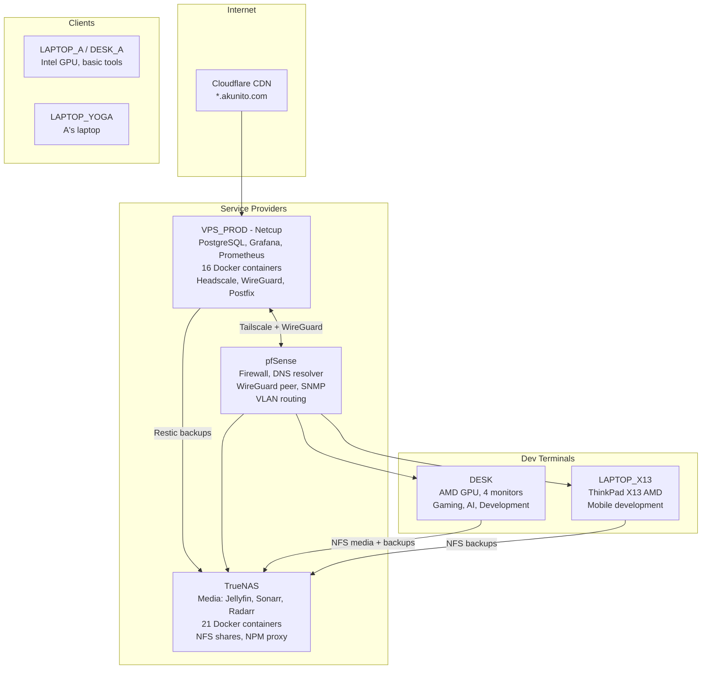
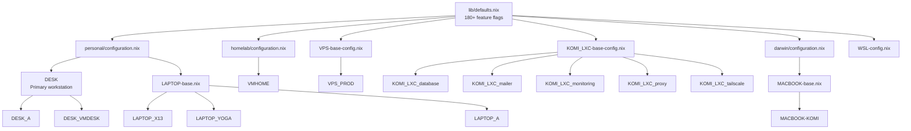

# NixOS Dotfiles

A **modular, hierarchical** NixOS configuration system with **180+ feature flags** and profile inheritance. Built on Nix flakes for reproducible, declarative system configuration across desktops, laptops, VPS, containers, and macOS.

## Infrastructure Overview



## Profile Hierarchy

Every machine gets a **profile** that inherits from a base config. Feature flags in `lib/defaults.nix` control what software is enabled.



## Key Features

- **Desktop environments**: Plasma 6, SwayFX, Hyprland with Stylix system-wide theming (55+ themes)
- **Gaming**: Steam, Proton (Lutris, Bottles, Heroic), emulators (Dolphin, RPCS3), Star Citizen optimizations
- **Development**: NixVim (Cursor-like), VSCode, AI tools (LM Studio, Ollama, aichat), Rust/Python/Go/Node
- **Monitoring**: Grafana + Prometheus with Telegram/email alerting, 20+ alert rules
- **Backups**: Restic-based with systemd timers (VPS to TrueNAS via SFTP, workstations via NFS)
- **Networking**: Self-hosted Headscale (Tailscale), WireGuard site-to-site, Cloudflare Tunnel
- **Security**: LUKS encryption with remote SSH unlock, git-crypt secrets, file hardening
- **Docker**: Rootless Docker Compose stacks managed declaratively via NixOS
- **Multi-user**: Two users (akunito/komi) on separate branches sharing infrastructure
- **Multi-platform**: NixOS (x86_64), nix-darwin (macOS), WSL, LXC containers

## Quick Start

```bash
git clone https://github.com/akunito/nixos-config.git ~/.dotfiles
cd ~/.dotfiles
./install.sh ~/.dotfiles DESK -s -u
```

See [Getting Started](docs/getting-started.md) for profile selection, configuration, and remote deployment.

## Documentation

| Topic | Description |
|-------|-------------|
| [Getting Started](docs/getting-started.md) | Installation, profiles, configuration |
| [Daily Usage](docs/daily-usage.md) | aku commands, maintenance, scripts |
| [Infrastructure](docs/akunito/infrastructure/INFRASTRUCTURE.md) | VPS, TrueNAS, pfSense services |
| [Backups](docs/security/restic-backups.md) | Restic backup strategy |
| [Monitoring](docs/akunito/infrastructure/services/monitoring-stack.md) | Prometheus + Grafana |
| [Multi-User](docs/multi-user-workflow.md) | Branch workflow (akunito/komi) |
| [Feature Flags](docs/profile-feature-flags.md) | Software flag patterns |
| [Themes](docs/themes.md) | Stylix theming system |
| [Security](docs/security/) | LUKS, git-crypt, hardening |
| [Keybindings](docs/akunito/keybindings/) | Sway, Hyprland shortcuts |

Use the [Router](docs/00_ROUTER.md) for quick topic lookup or the [Catalog](docs/01_CATALOG.md) for browsing all docs.

## Project Structure

```
.dotfiles/
├── flake.nix                 # Unified flake with all profiles and inputs
├── flake.lock                # Locked dependency versions
├── lib/
│   ├── defaults.nix          # Global defaults and 180+ feature flags
│   ├── flake-unified.nix     # Generates configurations for all profiles
│   └── flake-base.nix        # Profile builder
├── profiles/
│   ├── personal/             # Personal profile templates
│   ├── homelab/              # Server profile templates
│   ├── darwin/               # macOS/nix-darwin templates
│   ├── DESK-config.nix       # Desktop configuration
│   ├── LAPTOP-base.nix       # Laptop base (inherited by X13, YOGA, A)
│   ├── VPS-base-config.nix   # VPS base (inherited by VPS_PROD)
│   └── ...
├── system/                   # System-level NixOS modules
├── user/                     # User-level Home Manager modules
├── themes/                   # 55+ base16 themes
├── docs/                     # Documentation (Router/Catalog system)
├── secrets/                  # Encrypted secrets (git-crypt)
└── scripts/                  # Utility scripts
```

## Credits & License

Forked from [Librephoenix's NixOS configuration](https://github.com/librephoenix/nixos-config), significantly enhanced with hierarchical profile inheritance, centralized software management, multi-platform support, full-stack VPS deployment, and comprehensive monitoring.

Provided as-is for personal use.
