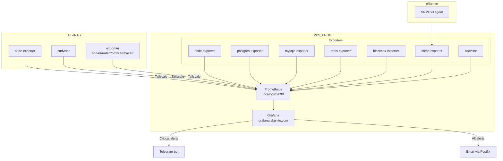

# Monitoring Stack

All monitoring runs on the VPS as NixOS native services.

## Components

| Service | Port | Access |
|---------|------|--------|
| Prometheus | 9090 | localhost only |
| Grafana | — | grafana.akunito.com (Cloudflare tunnel) |
| Blackbox exporter | 9115 | HTTP/ICMP probes |
| Node exporter | 9091 | Host metrics |
| SNMP exporter | 9116 | pfSense SNMP via WireGuard |
| Graphite exporter | 9108 | TrueNAS graphite metrics |
| PostgreSQL exporter | 9187 | DB metrics |
| MySQL exporter | 9104 | MariaDB metrics |
| Redis exporter | 9121 | Redis metrics |

## Prometheus Scrape Targets

### Local (VPS)

| Target | Port | Metrics |
|--------|------|---------|
| node-exporter | 9091 | CPU, RAM, disk, network |
| postgres-exporter | 9187 | PostgreSQL stats |
| mysqld-exporter | 9104 | MariaDB stats |
| redis-exporter | 9121 | Redis stats |
| synapse-metrics | 9000 | Matrix Synapse |

### Remote via Tailscale

| Target | Host | Metrics |
|--------|------|---------|
| TrueNAS exportarr (4x) | 192.168.20.200 | Sonarr/Radarr/Prowlarr/Bazarr |
| TrueNAS graphite | 192.168.20.200 | ZFS, disk, system metrics |

### Remote via WireGuard

| Target | Host | Metrics |
|--------|------|---------|
| pfSense SNMP | 192.168.8.1 | Interface stats, firewall |

### Blackbox HTTP Probes

All public services: plane, portfolio, matrix, element, nextcloud, miniflux, grafana, headscale, liftcraft, syncthing, obsidian, unifi, vault, status

### Blackbox ICMP Probes

pfSense (192.168.8.1), WAN gateway

## Grafana

- Domain: grafana.akunito.com via Cloudflare tunnel
- Alerting: Postfix relay (localhost:25)
- Dashboards migrated from LXC_monitoring [archived] (Feb 2026)
- Declarative provisioning via NixOS grafana.nix module

## Key Alerts

| Alert | Condition |
|-------|-----------|
| Backup freshness | databases > 4h, services/nextcloud > 48h |
| TLS cert expiry | < 7 days |
| Disk usage | < 25% free |
| Memory | < 1GB available (warn), < 512MB (critical) |
| Service down | Any Prometheus target down > 5min |
| TrueNAS not reporting | > 24h (expected during sleep) |

## TrueNAS Exporters

4 exportarr containers on TrueNAS (compose project: exporters) provide *arr stack metrics. Scraped by VPS Prometheus via Tailscale.

## Previous Setup [Archived]

*(Archived: akunito's Proxmox LXC containers were shut down Feb 2026, services migrated to VPS_PROD)*

LXC_monitoring (192.168.8.85) ran Prometheus + Grafana + blackbox + PVE exporter + SNMP exporter. Decommissioned Feb 2026. PVE exporter dropped (Proxmox shut down).
