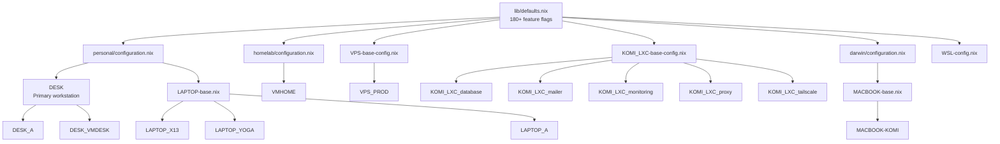

# Getting Started

## Prerequisites

- NixOS installed (or NixOS installation media)
- Git, sudo/root access
- Flakes enabled: `nix.settings.experimental-features = [ "nix-command" "flakes" ];`

## Quick Install

```bash
git clone https://github.com/akunito/nixos-config.git ~/.dotfiles
cd ~/.dotfiles

# Interactive install
./install.sh ~/.dotfiles PROFILE

# Silent install with user sync
./install.sh ~/.dotfiles PROFILE -s -u
```

**Flags:** `-s` silent, `-u` include Home Manager sync, `-d` skip Docker, `-h` skip hardware-config (LXC only)

## Profile Selection

Each machine gets a **profile** — a config file that sets hostname, enabled features, and packages. Profiles inherit from base configs to reduce duplication.



### Active Profiles

| Profile | Type | Machine | Key Features |
|---------|------|---------|-------------|
| `DESK` | Desktop | Primary workstation | AMD GPU, gaming, AI, 4 monitors |
| `DESK_A` | Desktop | Secondary | Simplified, inherits DESK |
| `DESK_VMDESK` | Desktop | VM | Development-focused |
| `LAPTOP_X13` | Laptop | ThinkPad X13 AMD | Mobile development |
| `LAPTOP_YOGA` | Laptop | Lenovo Yoga | Reduced features |
| `LAPTOP_A` | Laptop | Secondary | Minimal tools |
| `VPS_PROD` | Server | Netcup RS 4000 | Docker, PostgreSQL, Grafana, Headscale, LUKS |
| `VMHOME` | Server | Homelab VM | Docker, NFS |
| `KOMI_LXC_*` | Container | Komi's Proxmox | 5 LXC containers (database, mailer, monitoring, proxy, tailscale) |
| `MACBOOK-KOMI` | macOS | MacBook | nix-darwin, Homebrew casks |
| `WSL` | WSL | Windows | Minimal NixOS on WSL |

## Configuration Structure

```
flake.nix                 # Unified flake — all profiles and inputs
├── lib/
│   ├── defaults.nix      # Global defaults and 180+ feature flags
│   ├── flake-unified.nix # Generates configs for all profiles
│   └── flake-base.nix    # Per-profile builder
├── profiles/
│   ├── personal/         # configuration.nix + home.nix for personal machines
│   ├── homelab/          # Server profile templates
│   ├── darwin/           # macOS/nix-darwin templates
│   ├── DESK-config.nix   # Profile settings (hostname, flags, packages)
│   └── ...
├── system/               # System-level NixOS modules
├── user/                 # User-level Home Manager modules
├── themes/               # 55+ base16 themes
└── secrets/              # Encrypted secrets (git-crypt)
```

**Key concept:** Each profile config sets `systemSettings` and `userSettings` which flow into modules via `specialArgs` / `extraSpecialArgs`.

### Software Control via Feature Flags

All software is controlled through centralized flag sections in profile configs:

```nix
# profiles/DESK-config.nix
{
  systemSettings = {
    hostname = "nixosaku";
    gpuType = "amd";

    # === SOFTWARE FLAGS (centralized) ===
    systemBasicToolsEnable = true;
    developmentToolsEnable = true;
    sambaEnable = true;
    dockerEnable = true;
  };

  userSettings = {
    username = "akunito";
    wm = "plasma6";

    # === USER SOFTWARE FLAGS (centralized) ===
    userBasicPkgsEnable = true;
    protongamesEnable = true;
    steamPackEnable = true;
  };
}
```

Flags default to `false` in `lib/defaults.nix`. Each profile explicitly enables what it needs.

## Creating a New Profile

1. Create a config file inheriting from a base:

```nix
# profiles/MYPC-config.nix
let base = import ./LAPTOP-base.nix;
in {
  systemSettings = base.systemSettings // {
    hostname = "mypc";
    gpuType = "intel";
    systemBasicToolsEnable = true;
    developmentToolsEnable = true;
  };
  userSettings = base.userSettings // {
    username = "myuser";
    userBasicPkgsEnable = true;
  };
}
```

2. Register in `flake.nix` profiles map:
```nix
profiles = {
  MYPC = ./profiles/MYPC-config.nix;
};
```

3. Install: `./install.sh ~/.dotfiles MYPC -s -u`

## Remote Deployment

**Always use `install.sh`** — never bare `nixos-rebuild switch` on remote machines. See `CLAUDE.md` for full deployment rules.

```bash
# VPS (passwordless sudo)
ssh -A -p 56777 akunito@<VPS-IP> \
  "cd ~/.dotfiles && git fetch origin && git reset --hard origin/main && \
   ./install.sh ~/.dotfiles VPS_PROD -s -u -d"

# Komi LXC (passwordless sudo)
ssh -A admin@<LXC-IP> \
  "cd ~/.dotfiles && git fetch origin && git reset --hard origin/main && \
   ./install.sh ~/.dotfiles KOMI_LXC_database -s -u -d -h"

# Physical machines — run on the target machine
cd ~/.dotfiles && git fetch origin && git reset --hard origin/main && \
  ./install.sh ~/.dotfiles LAPTOP_X13 -s -u
```

## Troubleshooting

**Build fails:** Update flake inputs with `aku update`, then retry with `aku sync`.

**Software missing after install:** Home Manager likely failed due to file conflicts. Remove conflicting files (e.g., `rm ~/.gtkrc-2.0 ~/.config/Trolltech.conf`) and run `aku sync` again.

**Theme not applying:** Run `aku refresh` and verify `stylixEnable = true` in your profile.

**Docker boot issues:** The `install.sh` script stops containers automatically. If manual: `docker stop $(docker ps -q)` before rebuilding.

## Further Reading

- [Daily Usage](daily-usage.md) — aku commands, maintenance, scripts
- [Infrastructure](akunito/infrastructure/INFRASTRUCTURE.md) — VPS, TrueNAS, pfSense services
- [Feature Flags](profile-feature-flags.md) — software flag patterns
- [Themes](themes.md) — Stylix theming system
- [Configuration details (archived)](archived/configuration.md) — full variable reference
