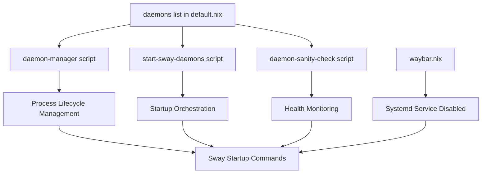

# SwayFX Daemon Integration System

Complete guide to the unified daemon management system for SwayFX components.

## Table of Contents

- [Overview](#overview)
- [Architecture](#architecture)
- [Daemon Definition](#daemon-definition)
- [Generated Scripts](#generated-scripts)
- [Integration Points](#integration-points)
- [Critical Requirements](#critical-requirements)
- [Waybar Compatibility](#waybar-compatibility)
- [Modification Guide](#modification-guide)
- [Common Pitfalls](#common-pitfalls)
- [Troubleshooting](#troubleshooting)
- [Examples](#examples)

## Overview

The SwayFX daemon integration system provides a unified, DRY (Don't Repeat Yourself) approach to managing all SwayFX-related daemons. It solves several critical issues:

- **NixOS Binary Wrappers**: NixOS wraps binaries (e.g., `waybar` becomes `.waybar-wrapped`), making process matching unreliable with `pgrep -x`
- **Systemd Conflicts**: Home Manager modules can auto-generate Systemd services that conflict with manual daemon management
- **Duplicate Instances**: Without proper management, daemons can spawn multiple instances during reloads
- **Self-Termination Bugs**: Using `pkill -f` can match the manager script's own arguments, causing it to kill itself

### What It Does

The system:
- Manages daemon lifecycle (start, stop, reload)
- Prevents duplicate instances
- Handles NixOS wrapper issues
- Prevents Systemd conflicts
- Provides health monitoring
- Supports smart reload (SIGUSR2 for waybar)

## Architecture

The system uses a **single source of truth** approach:



### Component Relationships

1. **Daemon List** (`user/wm/sway/default.nix`, lines 36-111)
   - Single source of truth for all daemon definitions
   - Contains: name, command, pattern, match_type, reload, requires_sway

2. **Generated Scripts** (auto-generated from daemon list)
   - `daemon-manager`: Unified daemon lifecycle manager
   - `start-sway-daemons`: Startup orchestrator with file locking
   - `daemon-sanity-check`: Health check script

3. **Integration Points**
   - Sway startup commands (`default.nix`, lines 549-575)
   - Systemd service conflict prevention (`waybar.nix`, line 8)

### DRY Principle

All three scripts are generated from the same `daemons` list using Nix's `lib.concatMapStringsSep`. This ensures:
- No duplication of daemon definitions
- Consistency across all scripts
- Single point of modification

## Daemon Definition

Each daemon is defined as an attribute set in the `daemons` list:

```nix
{
  name = "waybar";
  # Explicit config path ensures waybar uses the correct config file
  # generated by programs.waybar.settings (Sway-specific modules)
  command = "${pkgs.waybar}/bin/waybar -c ${config.xdg.configHome}/waybar/config";
  pattern = "/bin/waybar";
  match_type = "full";
  reload = "${pkgs.procps}/bin/pkill -f -SIGUSR2 /bin/waybar";
  requires_sway = true;
}
```

**Note**: The explicit config path (`-c`) is required because Sway and Hyprland both use `programs.waybar` which writes to the same file (`~/.config/waybar/config`). They are mutually exclusive in the same profile. See [Waybar Compatibility](#waybar-compatibility) for details.

### Required Fields

#### `name` (string)
- Human-readable name for the daemon
- Used in logging and sanity checks
- Example: `"waybar"`, `"nwg-dock"`, `"swaync"`

#### `command` (string)
- Full command to start the daemon
- Must use absolute paths (Nix store paths)
- Can include command-line arguments (e.g., config file paths)
- Example: `"${pkgs.waybar}/bin/waybar -c ${config.xdg.configHome}/waybar/config"`
- Example: `"${pkgs.libinput-gestures}/bin/libinput-gestures"`

#### `pattern` (string)
- Pattern used for `pgrep` to find running instances
- Must be specific enough to avoid false positives
- For NixOS-wrapped binaries, use full path patterns
- Example: `"/bin/waybar"` (avoids matching `swaybar`)

#### `match_type` (string)
- Either `"exact"` or `"full"`
- `"exact"`: Uses `pgrep -x` (exact process name match)
- `"full"`: Uses `pgrep -f` (full command line match)
- **CRITICAL**: Always use `"full"` for NixOS-wrapped binaries

#### `reload` (string)
- Command to reload the daemon without restarting
- Empty string `""` if reload is not supported
- For waybar: `"${pkgs.procps}/bin/pkill -f -SIGUSR2 /bin/waybar"`
- For swaync: `"${pkgs.swaynotificationcenter}/bin/swaync-client -R"`

#### `requires_sway` (boolean)
- Whether the daemon requires SwayFX IPC to be ready before starting
- `true`: Waits for `swaymsg -t get_outputs` to succeed (max 10 seconds)
- `false`: Starts immediately (e.g., `nm-applet`, `kwalletd6`)
- **Note**: Daemons that send Sway commands (e.g., `libinput-gestures`) must set this to `true`

### NixOS-Specific Considerations

#### Binary Wrappers

NixOS wraps binaries, changing their process name:
- `waybar` → `.waybar-wrapped`
- `swaync` → `.swaync-wrapped`
- `nm-applet` → `.nm-applet-wrapped`

**Solution**: Always use `match_type = "full"` and specific patterns:
- ✅ `pattern = "/bin/waybar"` (matches full command line)
- ❌ `pattern = "waybar"` (too broad, matches `swaybar`)

#### Pattern Specificity

Patterns must be specific to avoid false positives:
- ✅ `pattern = "/bin/waybar"` (specific, avoids `swaybar`)
- ❌ `pattern = "waybar"` (matches `swaybar` and `waybar-startup.sh`)

## Generated Scripts

### daemon-manager

**Purpose**: Unified daemon lifecycle manager

**Usage**: `daemon-manager [PATTERN] [MATCH_TYPE] [COMMAND] [RELOAD_CMD] [REQUIRES_SWAY]`

**Features**:
- Process detection and counting
- Duplicate instance cleanup
- Smart reload support (SIGUSR2 for waybar)
- Safe kill logic (prevents self-termination)
- SwayFX IPC readiness checks
- Systemd journal logging

**Logic Flow**:
1. Check if process is running using `pgrep`
2. If multiple instances: kill all and restart
3. If single instance with reload support: send reload signal
4. If single instance without reload: leave running
5. If not running: start new instance

### start-sway-daemons

**Purpose**: Startup orchestrator with file locking

**Features**:
- File locking to prevent concurrent execution
- Waybar starts first (synchronously) to avoid race conditions
- Other daemons start in parallel
- Uses XDG runtime directory for lock file

**Lock File**: `/run/user/$(id -u)/sway-startup.lock`

**Startup Order**:
1. Waybar (synchronous, critical)
2. All other daemons (parallel)

### daemon-sanity-check

**Purpose**: Health check script

**Usage**: 
- `daemon-sanity-check` - Check status only
- `daemon-sanity-check --fix` - Check and fix missing daemons

**Features**:
- Checks all daemons from the `daemons` list
- Reports missing daemons
- Can automatically fix missing daemons
- Logs to systemd journal (`sway-daemon-check` tag)

## Integration Points

### Sway Startup Configuration

Located in `user/wm/sway/default.nix` (lines 549-575):

```nix
startup = [
  # ... other startup commands ...
  {
    command = "${start-sway-daemons}/bin/start-sway-daemons";
    always = true;  # Run on startup and reload
  }
  {
    command = "${daemon-sanity-check}/bin/daemon-sanity-check --fix";
    always = false;  # Only on initial startup
  }
];
```

**Notes**:
- `start-sway-daemons` runs with `always = true` (executes on reload)
- `daemon-sanity-check` runs with `always = false` (only on initial startup)

### Systemd Service Conflict Prevention

When Home Manager modules auto-generate Systemd services, they must be disabled:

**Example** (`user/wm/sway/waybar.nix`):
```nix
programs.waybar = {
  enable = true;
  systemd.enable = false;  # CRITICAL: Disable Systemd service
  # ... configuration ...
};
```

**Why**: If both Systemd and `daemon-manager` try to start waybar, you get duplicate instances.

**Hyprland Note**: Hyprland's waybar configuration also requires `systemd.enable = false` to prevent conflicts with its `exec-once` startup mechanism.

### Waybar Compatibility

**CRITICAL**: Sway and Hyprland both use Home Manager's `programs.waybar` module, which writes to the same config file: `~/.config/waybar/config`.

**The Problem**:
- Both WMs generate their own waybar config with different modules (`sway/workspaces` vs `hyprland/workspaces`)
- If both are enabled in the same profile, Home Manager will have a file conflict
- The last one to build will overwrite the other's config

**The Solution**:
- **Mutual Exclusivity**: Sway and Hyprland profiles are mutually exclusive for waybar
- **Explicit Config Path**: Sway's waybar command uses `-c ${config.xdg.configHome}/waybar/config` to explicitly point to the generated config
- **Systemd Disabled**: Both WMs disable Systemd services to prevent conflicts

**Current Implementation**:
- Sway: Uses `daemon-manager` with explicit config path
- Hyprland: Uses `exec-once` with Systemd disabled
- Both: `systemd.enable = false` in their respective `programs.waybar` blocks

**Future Enhancement**: Could use separate config files (`config-sway`, `config-hyprland`) via `xdg.configFile`, but this would bypass `programs.waybar.settings`.

## Critical Requirements

### Safe Kill Logic

**CRITICAL**: Always filter out `$$` (self PID) and `$PPID` (parent PID) when killing processes.

**Problem**: Using `pkill -f [PATTERN]` matches command line arguments. If the manager script's arguments contain the pattern, it kills itself.

**Solution**: Use `safe_kill` function that:
1. Gets all matching PIDs with `pgrep`
2. Filters out `$$` (script's own PID)
3. Filters out `$PPID` (parent PID)
4. Kills remaining PIDs explicitly with `kill`

**Example** (from `daemon-manager`):
```sh
safe_kill() {
  local KILL_PATTERN="$1"
  local KILL_PGREP_FLAG="$2"
  local SELF_PID=$$
  local PARENT_PID=$PPID
  
  MATCHING_PIDS=$(${pkgs.procps}/bin/pgrep $KILL_PGREP_FLAG "$KILL_PATTERN" 2>/dev/null || echo "")
  
  for PID in $MATCHING_PIDS; do
    if [ "$PID" != "$SELF_PID" ] && [ "$PID" != "$PARENT_PID" ]; then
      kill "$PID" 2>/dev/null || true
    fi
  done
}
```

**Never use**: `pkill -f [PATTERN]` directly without filtering

### Lock File Policy

**CRITICAL**: Lock files must use XDG runtime directories, never `/tmp/`.

**Required**: `/run/user/$(id -u)/sway-startup.lock`

**Why**:
- XDG runtime directories are automatically cleaned on logout/reboot
- `/tmp/` can have stale locks after crashes
- Security: `/run/user/$UID/` is user-specific and protected

**Implementation** (from `start-sway-daemons`):
```sh
LOCK_FILE="/run/user/$(id -u)/sway-startup.lock"
(
  flock -n 9 || { echo "Another startup process is running, exiting"; exit 0; }
  # ... startup code ...
) 9>"$LOCK_FILE"
```

**Never use**: `/tmp/sway-startup.lock` or similar

## Modification Guide

### Adding a New Daemon

1. **Add to `daemons` list** in `user/wm/sway/default.nix` (lines 36-111):

```nix
{
  name = "my-daemon";
  command = "${pkgs.my-daemon}/bin/my-daemon";
  pattern = "my-daemon";
  match_type = "full";  # Always use "full" for NixOS-wrapped binaries
  reload = "";  # Empty if no reload support
  requires_sway = true;  # true if needs SwayFX IPC
}
```

2. **Check for Systemd conflicts**:
   - If using `programs.my-daemon.enable = true`, check if it creates a Systemd service
   - If yes, add `systemd.enable = false` to prevent conflicts

3. **Test**:
   - Rebuild: `home-manager switch --flake ~/.dotfiles#PROFILE`
   - Check: `daemon-sanity-check`
   - Verify: `pgrep -f my-daemon`

### Removing a Daemon

1. **Remove from `daemons` list** in `user/wm/sway/default.nix`
2. **Remove Systemd service disable** if present (e.g., in `waybar.nix`)
3. **Test**: Rebuild and verify daemon is not started

### Modifying Daemon Properties

1. **Edit the daemon entry** in the `daemons` list
2. **Common changes**:
   - Command: Update `command` field
   - Pattern: Update `pattern` if command changed
   - Reload: Update `reload` if reload mechanism changed
3. **Test**: Rebuild and verify changes work

### Changing Startup Order

**Current order**:
1. Waybar (synchronous, first)
2. All other daemons (parallel)

**To change**: Modify `start-sway-daemons` generation in `default.nix` (lines 288-310)

**Note**: Waybar must start first to avoid race conditions. Other daemons can be reordered if needed.

### Systemd Conflict Prevention

**CRITICAL**: When enabling Home Manager modules, always check for Systemd services.

**Checklist**:
1. Does `programs.app.enable = true` create a Systemd service?
2. Is the app managed by `daemon-manager`?
3. If both yes: Add `systemd.enable = false`

**Example**:
```nix
programs.waybar = {
  enable = true;
  systemd.enable = false;  # Required if managed by daemon-manager
  # ... configuration ...
};
```

## Common Pitfalls

### NixOS Wrapper Issues

**Problem**: Using `match_type = "exact"` with NixOS-wrapped binaries

**Symptom**: `pgrep -x waybar` returns nothing (process is `.waybar-wrapped`)

**Solution**: Always use `match_type = "full"` for NixOS-wrapped binaries

### Pattern Matching Mistakes

**Problem**: Pattern too broad (e.g., `"waybar"` matches `swaybar`)

**Symptom**: False positives, daemon-manager thinks daemon is running when it's not

**Solution**: Use specific patterns (e.g., `"/bin/waybar"`)

### Systemd Conflicts

**Problem**: Both Systemd and `daemon-manager` start the same daemon

**Symptom**: Multiple instances, race conditions

**Solution**: Disable Systemd service with `systemd.enable = false`

### Self-Termination Bugs

**Problem**: Using `pkill -f` without filtering `$$` and `$PPID`

**Symptom**: Manager script kills itself immediately after starting

**Solution**: Always use `safe_kill` function that filters self and parent PIDs

### Lock File Location Mistakes

**Problem**: Using `/tmp/` for lock files

**Symptom**: Stale locks after crashes, security issues

**Solution**: Always use `/run/user/$(id -u)/` (XDG runtime directory)

## Troubleshooting

### Debugging Daemon Startup

1. **Check logs**:
   ```sh
   journalctl --user -t sway-daemon-mgr --since "5 minutes ago"
   ```

2. **Check process**:
   ```sh
   pgrep -af "daemon-name"
   ```

3. **Run sanity check**:
   ```sh
   daemon-sanity-check --fix
   ```

### Checking Logs

**Daemon manager logs**:
```sh
journalctl --user -t sway-daemon-mgr
```

**Sanity check logs**:
```sh
journalctl --user -t sway-daemon-check
```

**Specific daemon logs**:
```sh
journalctl --user -t sway-daemon-waybar
```

### Verifying Process Matching

1. **Check pattern**:
   ```sh
   pgrep -f "pattern"
   ```

2. **Verify match_type**:
   - `match_type = "exact"`: Use `pgrep -x`
   - `match_type = "full"`: Use `pgrep -f`

3. **Check for false positives**:
   ```sh
   pgrep -af "pattern" | grep -v "grep\|pgrep"
   ```

### Testing Changes

1. **Rebuild**:
   ```sh
   home-manager switch --flake ~/.dotfiles#PROFILE
   ```

2. **Reload Sway**:
   ```sh
   swaymsg reload
   ```

3. **Check status**:
   ```sh
   daemon-sanity-check
   ```

4. **Verify logs**:
   ```sh
   journalctl --user -t sway-daemon-mgr --since "1 minute ago"
   ```

## Examples

### Example: Adding a New Daemon

```nix
# In user/wm/sway/default.nix, add to daemons list:
{
  name = "my-applet";
  command = "${pkgs.my-applet}/bin/my-applet";
  pattern = "my-applet";
  match_type = "full";
  reload = "";
  requires_sway = false;
}
```

### Example: Adding Daemon with Reload Support

```nix
{
  name = "my-daemon";
  command = "${pkgs.my-daemon}/bin/my-daemon";
  pattern = "my-daemon";
  match_type = "full";
  reload = "${pkgs.my-daemon}/bin/my-daemon-client --reload";
  requires_sway = true;
}
```

### Example: Libinput-Gestures Configuration

Libinput-gestures is configured via `xdg.configFile` and managed by the daemon system:

**Daemon Definition** (`user/wm/sway/default.nix`):
```nix
{
  name = "libinput-gestures";
  command = "${pkgs.libinput-gestures}/bin/libinput-gestures";
  pattern = "libinput-gestures";
  match_type = "full";  # Python script/wrapper - full match required
  reload = "";
  requires_sway = true;  # Needs SwayFX IPC to send workspace commands
}
```

**Config File** (`user/wm/sway/default.nix`):
```nix
xdg.configFile."libinput-gestures.conf".text = ''
  # Libinput-gestures configuration for SwayFX
  # 3-finger swipe for workspace navigation (matches keybindings: next_on_output/prev_on_output)
  
  gesture swipe left 3 ${pkgs.swayfx}/bin/swaymsg workspace next_on_output
  gesture swipe right 3 ${pkgs.swayfx}/bin/swaymsg workspace prev_on_output
  # Optional: 3-finger swipe up for fullscreen toggle
  # gesture swipe up 3 ${pkgs.swayfx}/bin/swaymsg fullscreen toggle
'';
```

**Key Points**:
- Uses `${pkgs.swayfx}/bin/swaymsg` (not `${pkgs.sway}`) to match the running compositor
- Uses `next_on_output`/`prev_on_output` to prevent gestures from jumping between monitors
- `requires_sway = true` because it needs SwayFX IPC to send commands
- Config is generated via `xdg.configFile` for consistency with other XDG configs

### Example: Preventing Systemd Conflict

```nix
# In user/wm/sway/my-daemon.nix:
programs.my-daemon = {
  enable = true;
  systemd.enable = false;  # CRITICAL: Disable if managed by daemon-manager
  # ... configuration ...
};
```

## Related Documentation

- [User Modules Guide](user-modules.md) - Overview of user modules
- [Sway Configuration](../wm/sway.md) - SwayFX configuration guide
- [System Modules](../system-modules.md) - System-level modules

## See Also

- Source: [`user/wm/sway/default.nix`](../../user/wm/sway/default.nix) - Main configuration file
- Source: [`user/wm/sway/waybar.nix`](../../user/wm/sway/waybar.nix) - Waybar configuration with Systemd disable
- Source: [`user/wm/hyprland/hyprland.nix`](../../user/wm/hyprland/hyprland.nix) - Hyprland configuration with waybar Systemd disable

