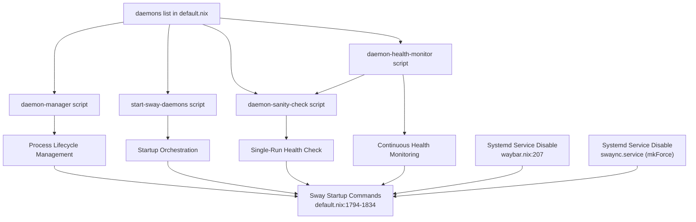

# SwayFX Daemon Integration System

Complete guide to the unified daemon management system for SwayFX components.

## Table of Contents

- [Overview](#overview)
- [Architecture](#architecture)
- [Daemon Definition](#daemon-definition)
- [Generated Scripts](#generated-scripts)
- [Integration Points](#integration-points)
- [Critical Requirements](#critical-requirements)
- [Waybar Compatibility](#waybar-compatibility)
- [Modification Guide](#modification-guide)
- [Common Pitfalls](#common-pitfalls)
- [Troubleshooting](#troubleshooting)
- [Examples](#examples)

**Key Sections**:
- [Safe Kill Functions](#safe-kill-functions) - Pattern-based and PID-based safe kill functions
- [Waybar-Specific Cleanup Logic](#waybar-specific-cleanup-logic) - Special cleanup for waybar store path changes
- [Store Path Extraction Best Practices](#store-path-extraction-best-practices) - Robust methods for extracting Nix store paths
- [Systemd Trade-offs](#systemd-trade-offs) - What we gain and lose by not using Systemd
- [Terminology Clarification](#terminology-clarification) - Sanity Check vs Health Monitor

## Overview

The SwayFX daemon integration system provides a unified, DRY (Don't Repeat Yourself) approach to managing all SwayFX-related daemons. It solves several critical issues:

- **NixOS Binary Wrappers**: NixOS wraps binaries (e.g., `waybar` becomes `.waybar-wrapped`), making process matching unreliable with `pgrep -x`
- **Systemd Conflicts**: Home Manager modules can auto-generate Systemd services that conflict with manual daemon management
- **Duplicate Instances**: Without proper management, daemons can spawn multiple instances during reloads
- **Self-Termination Bugs**: Using `pkill -f` can match the manager script's own arguments, causing it to kill itself

**Note**: SwayFX's default internal bar (`swaybar`) is disabled by default and can be toggled manually. It is **not** managed by the daemon system as it's part of SwayFX itself, not an external daemon.

### What It Does

The system:
- Manages daemon lifecycle (start, stop, reload)
- Prevents duplicate instances
- Handles NixOS wrapper issues
- Prevents Systemd conflicts
- Provides health monitoring
- Supports smart reload (SIGUSR2 for waybar)

## Architecture

The system uses a **single source of truth** approach:



### Component Relationships

1. **Daemon List** (`user/wm/sway/default.nix`, lines 167-262)
   - Single source of truth for all daemon definitions
   - Contains: name, command, pattern, match_type, reload, requires_sway, requires_tray (optional)

2. **Generated Scripts** (auto-generated from daemon list)
   - `daemon-manager`: Unified daemon lifecycle manager
   - `start-sway-daemons`: Startup orchestrator with file locking
   - `daemon-sanity-check`: Health check script (single-run)
   - `daemon-health-monitor`: Continuous background health monitor

3. **Integration Points**
   - Sway startup commands (`default.nix`, lines 1296-1333)
   - Systemd service conflict prevention (`waybar.nix`, line 207)

### DRY Principle

All three scripts are generated from the same `daemons` list using Nix's `lib.concatMapStringsSep`. This ensures:
- No duplication of daemon definitions
- Consistency across all scripts
- Single point of modification

## Daemon Definition

Each daemon is defined as an attribute set in the `daemons` list:

```nix
{
  name = "waybar";
  # Explicit config path ensures waybar uses the correct config file
  # generated by programs.waybar.settings (Sway-specific modules)
  command = "${pkgs.waybar}/bin/waybar -c ${config.xdg.configHome}/waybar/config";
  pattern = "^${pkgs.waybar}/bin/waybar";  # Anchored Nix store path prevents false positives
  match_type = "full";
  reload = "${pkgs.procps}/bin/pkill -USR2 -f '^${pkgs.waybar}/bin/waybar'";  # Anchored pattern for reliable reload
  requires_sway = true;
}
```

**Note**: The explicit config path (`-c`) is required because Sway and Hyprland both use `programs.waybar` which writes to the same file (`~/.config/waybar/config`). They are mutually exclusive in the same profile. See [Waybar Compatibility](#waybar-compatibility) for details.

### Required Fields

#### `name` (string)
- Human-readable name for the daemon
- Used in logging and sanity checks
- Example: `"waybar"`, `"nwg-dock"`, `"swaync"`

#### `command` (string)
- Full command to start the daemon
- Must use absolute paths (Nix store paths)
- Can include command-line arguments (e.g., config file paths)
- Example: `"${pkgs.waybar}/bin/waybar -c ${config.xdg.configHome}/waybar/config"`
- Example: `"${pkgs.libinput-gestures}/bin/libinput-gestures"`

#### `pattern` (string)
- Pattern used for `pgrep` to find running instances
- Must be specific enough to avoid false positives
- **CRITICAL**: Always use anchored Nix store paths for NixOS-wrapped binaries
- Example: `"^${pkgs.waybar}/bin/waybar"` (anchored pattern prevents false positives)
- Example: `"^${pkgs.swaynotificationcenter}/bin/swaync"` (anchored pattern)
- **Note**: For complex pipe commands (e.g., `cliphist`), regex patterns may be needed: `"wl-paste.*cliphist"`

#### `match_type` (string)
- Either `"exact"` or `"full"`
- `"exact"`: Uses `pgrep -x` (exact process name match)
- `"full"`: Uses `pgrep -f` (full command line match)
- **CRITICAL**: Always use `"full"` for NixOS-wrapped binaries

#### `reload` (string)
- Command to reload the daemon without restarting
- Empty string `""` if reload is not supported
- For waybar: `"${pkgs.procps}/bin/pkill -USR2 -f '^${pkgs.waybar}/bin/waybar'"` (anchored pattern)
- For swaync: `"${pkgs.swaynotificationcenter}/bin/swaync-client -R"`

#### `requires_sway` (boolean)
- Whether the daemon requires SwayFX IPC to be ready before starting
- `true`: Waits for SwayFX IPC to be ready before starting
  - **For waybar**: Extended timeout of 21 seconds (delays: 1s, 2s, 3s, 4s, 5s, 6s) due to workspace module requiring full IPC functionality
  - **For other daemons**: Standard timeout of 10.5 seconds (delays: 0.5s, 1s, 1.5s, 2s, 2.5s, 3s)
  - **Checks performed**:
    - `swaymsg -t get_outputs` succeeds
    - `swaymsg -t get_workspaces` succeeds
    - Socket exists: `$XDG_RUNTIME_DIR/sway-ipc.$(id -u).$SWAY_PID.sock`
    - **Optimization**: Fast-fail check for `$SWAYSOCK` environment variable - if set but socket doesn't exist, wait and retry to avoid `swaymsg` timeout hangs
- `false`: Starts immediately (e.g., `nm-applet`, `kwalletd6`)
- **Note**: Daemons that send Sway commands (e.g., `libinput-gestures`) must set this to `true`
- **Timing Note**: On boot, IPC is ready in ~1-2 seconds. On relog scenarios, IPC can take ~15-21 seconds to initialize, which is why waybar has an extended timeout.

#### `requires_tray` (boolean, optional)
- Whether the daemon requires the system tray (StatusNotifierWatcher) to be ready before starting
- `true`: Waits for `org.freedesktop.StatusNotifierWatcher` to be available on DBus (exponential backoff: 1s, 2s, 4s, 8s, max 15 seconds)
- `false` or omitted: Starts immediately
- **Use case**: System tray applets (e.g., `nm-applet`, `blueman-applet`) that need to register with waybar's tray module
- **Note**: This ensures waybar's tray module has registered as StatusNotifierWatcher before applets try to connect, preventing "No such object path" errors

### NixOS-Specific Considerations

#### Binary Wrappers

NixOS wraps binaries, changing their process name:
- `waybar` → `.waybar-wrapped`
- `swaync` → `.swaync-wrapped`
- `nm-applet` → `.nm-applet-wrapped`

**Solution**: Always use `match_type = "full"` and anchored Nix store path patterns:
- ✅ `pattern = "^${pkgs.waybar}/bin/waybar"` (anchored pattern, prevents false positives)
- ❌ `pattern = "/bin/waybar"` (can match false positives like editing config files)
- ❌ `pattern = "waybar"` (too broad, matches `swaybar` and `waybar-startup.sh`)

#### Pattern Specificity

Patterns must be specific to avoid false positives. **Always use anchored Nix store paths**:
- ✅ `pattern = "^${pkgs.waybar}/bin/waybar"` (anchored pattern, prevents false positives)
- ✅ `pattern = "^${pkgs.swaynotificationcenter}/bin/swaync"` (anchored pattern)
- ❌ `pattern = "/bin/waybar"` (can match false positives like editing `~/bin/waybar-config`)
- ❌ `pattern = "waybar"` (matches `swaybar` and `waybar-startup.sh`)

**Why Anchored Patterns**: The `^` anchor ensures the pattern matches the start of the command line, preventing substring matches in file paths or script arguments. Combined with the full Nix store path, this provides maximum specificity and reliability.

## Generated Scripts

### daemon-manager

**Purpose**: Unified daemon lifecycle manager

**Usage**: `daemon-manager [PATTERN] [MATCH_TYPE] [COMMAND] [RELOAD_CMD] [REQUIRES_SWAY]`

**Features**:
- Process detection and counting
- Duplicate instance cleanup
- Smart reload support (SIGUSR2 for waybar)
- Safe kill logic (prevents self-termination)
- SwayFX IPC readiness checks
- Systemd journal logging

**Logic Flow**:
1. Check if process is running using `pgrep`
2. If multiple instances: kill all and restart
3. If single instance with reload support: send reload signal
4. If single instance without reload: leave running
5. If not running: start new instance

### start-sway-daemons

**Purpose**: Startup orchestrator with file locking and session cleanup

**Features**:
- File locking to prevent concurrent execution
- Session cleanup phase (kills orphaned daemons from previous sessions)
  - **Generic cleanup for waybar and swaync**: Kills ALL processes regardless of pattern/store path to prevent "Instance already running" errors
  - **Pattern-based cleanup for other daemons**: Uses daemon-specific patterns from the daemon list
- PID-based Sentinel pattern to distinguish fresh startup from config reload
- Stale socket cleanup: Removes SwayFX IPC sockets from previous sessions
- Waybar starts first (synchronously) to avoid race conditions
- Other daemons start in parallel
- Uses XDG runtime directory for lock file and sentinel

**Lock File**: `/run/user/$(id -u)/sway-startup.lock`

**Sentinel File**: `/run/user/$(id -u)/sway-session-init-$PPID`

**Startup Order**:
1. Session cleanup (only on fresh startup, not on reload)
2. Waybar (synchronous, critical)
3. All other daemons (parallel)

### daemon-sanity-check

**Purpose**: Health check script

**Usage**: 
- `daemon-sanity-check` - Check status only
- `daemon-sanity-check --fix` - Check and fix missing daemons

**Features**:
- Checks all daemons from the `daemons` list
- Reports missing daemons
- Can automatically fix missing daemons
- Logs to systemd journal (`sway-daemon-check` tag)

### daemon-health-monitor

**Purpose**: Continuous background health monitor that periodically checks and restarts crashed daemons

**Usage**: Automatically started by Sway on session startup

**Features**:
- Runs continuously in background (not managed by `daemon-manager` to avoid circular dependency)
- Checks daemon health every 30 seconds
- Implements strike system for waybar (requires 3 consecutive failures before restart)
- Grace period of 60 seconds after startup to avoid false positives during initialization
- Exponential backoff for restart attempts (max 3 attempts = 90 seconds)
- Logs to systemd journal (`sway-daemon-monitor` tag)

**Strike System (Waybar)**:
- Requires 3 consecutive failures (90 seconds total) before attempting restart
- Prevents false positives from temporary `pgrep` failures or process state transitions
- Resets counter when waybar is detected as running

**Grace Period**:
- Waits 60 seconds after startup before beginning monitoring
- Prevents incorrect restart attempts during SwayFX and daemon initialization
- Critical for avoiding false negatives during startup phase

## Integration Points

### Sway Startup Configuration

Located in `user/wm/sway/default.nix` (lines 1296-1333):

```nix
startup = [
  # ... other startup commands ...
  {
    command = "${start-sway-daemons}/bin/start-sway-daemons";
    always = true;  # Run on startup and reload
  }
  {
    command = "${daemon-sanity-check}/bin/daemon-sanity-check --fix";
    always = false;  # Only on initial startup (safety net)
  }
  {
    command = "${daemon-health-monitor}/bin/daemon-health-monitor";
    always = true;  # Ensure it restarts if monitor crashes or Sway reloads
  }
];
```

**Notes**:
- `start-sway-daemons` runs with `always = true` (executes on reload) - primary startup mechanism
- Session cleanup only runs on fresh startup (detected via Sentinel pattern), not on `swaymsg reload`
- On reload, `daemon-manager` handles graceful reloads (SIGUSR2 for waybar, leave others running)
- `daemon-sanity-check` runs with `always = false` (only on initial startup) - safety net to catch any daemons that failed to start
- `daemon-health-monitor` runs with `always = true` (executes on reload) - critical infrastructure that must restart automatically

### Systemd Service Conflict Prevention

**CRITICAL**: Daemons managed by this system *must* have their systemd services disabled to prevent conflicts with `daemon-manager`.

When Home Manager modules auto-generate Systemd services, they must be disabled. There are two patterns depending on whether the package has a Home Manager module:

#### Pattern 1: Packages with Home Manager Modules (e.g., `waybar`)

**Example** (`user/wm/sway/waybar.nix`):
```nix
programs.waybar = {
  enable = true;
  systemd.enable = false;  # CRITICAL: Disable Systemd service
  # ... configuration ...
};
```

#### Pattern 2: Packages without Home Manager Modules (e.g., `swaync`)

Some packages (like `swaynotificationcenter`) auto-generate systemd services without a Home Manager module. These must be disabled in the main configuration file:

**Example** (`user/wm/sway/default.nix`):
```nix
# SYSTEMD CONFLICT RESOLUTION
# Disable the systemd service to prevent conflicts with our daemon-manager.
# The swaynotificationcenter package auto-generates swaync.service.
# Use mkForce to ensure it doesn't get linked to systemd targets by Home Manager
systemd.user.services.swaync = {
  install.wantedBy = lib.mkForce []; 
};
```

**Why**: If both Systemd and `daemon-manager` try to start the same daemon, you get duplicate instances and the systemd session is marked as "degraded".

**General Rule**: Any package added to the `daemons` list that also ships a systemd unit (like `swaync`, `mako`, `kanshi`) **must** have a corresponding `systemd.user.services.<name>` entry with `install.wantedBy = lib.mkForce []` in the Nix config to prevent the service from being enabled.

**Hyprland Note**: Hyprland's waybar configuration also requires `systemd.enable = false` to prevent conflicts with its `exec-once` startup mechanism.

### Waybar Compatibility

**CRITICAL**: Sway and Hyprland both use Home Manager's `programs.waybar` module, which writes to the same config file: `~/.config/waybar/config`.

**The Problem**:
- Both WMs generate their own waybar config with different modules (`sway/workspaces` vs `hyprland/workspaces`)
- In NixOS, profiles are mutually exclusive (separate generations/hosts), so symlinks change rather than files overwriting
- However, if both are enabled in the same activation, Home Manager will have a file conflict

**The Solution**:
- **Mutual Exclusivity**: Sway and Hyprland profiles are mutually exclusive for waybar (separate generations/hosts)
- **Explicit Config Path**: Sway's waybar command uses `-c ${config.xdg.configHome}/waybar/config` to explicitly point to the generated config (recommended for scripting clarity)
- **Systemd Disabled**: Both WMs disable Systemd services to prevent conflicts

**Current Implementation**:
- Sway: Uses `daemon-manager` with explicit config path
- Hyprland: Uses `exec-once` with Systemd disabled
- Both: `systemd.enable = false` in their respective `programs.waybar` blocks

**Future Enhancement**: Could use separate config files (`config-sway`, `config-hyprland`) via `xdg.configFile`, but this would bypass `programs.waybar.settings`.

### Swaybar (SwayFX Internal Bar)

**CRITICAL**: SwayFX's default internal bar (`swaybar`) is **disabled by default** and is **not** managed by the daemon system.

**Configuration** (`user/wm/sway/default.nix`, `extraConfig` section):
```nix
bar {
  mode invisible
  hidden_state hide
  position bottom
}
```

**Manual Toggle**:
- **Keybinding**: `${hyper}+Shift+Home` (Mod4+Control+Alt+Shift+Home) - toggles bar visibility
- **Script**: `~/.config/sway/scripts/swaybar-toggle.sh` - can be run manually or via keybinding
- **Command**: 
  - Show: `swaymsg bar mode dock`
  - Hide: `swaymsg bar mode invisible`
  - Toggle: Run the toggle script

**Why Disabled**:
- The system uses `waybar` (external status bar) instead of `swaybar` (SwayFX internal bar)
- `nwg-dock` provides the dock functionality
- Disabling `swaybar` prevents conflicts and reduces visual clutter

**Note**: `swaybar` is part of SwayFX itself, not an external daemon, so it's **not** included in the `daemons` list. It can be toggled on-demand if needed for debugging or specific use cases. The `swaybar` is completely independent of `nwg-dock` and `waybar` - disabling it does not affect dock functionality.

## Session Cleanup

**Purpose**: Automatically clean up orphaned daemon processes from previous Sway sessions when starting a new session.

### The Problem

When a Sway session closes (via `swaymsg exit`), daemon processes started by `daemon-manager` are not explicitly killed. These orphaned processes remain running and cause issues when a new Sway session starts:

- **Orphaned Processes**: Daemons from the previous session are still running
- **False Positives**: `daemon-manager` detects these old processes and either sends reload signals (for daemons with reload support) or leaves them running (for daemons without reload), but they're from a different session
- **Component Failures**: Components don't load correctly because old processes interfere with new session initialization

### The Solution

The `start-sway-daemons` script includes a **session cleanup phase** that uses a **PID-based Sentinel pattern** to distinguish between:

- **Fresh Session Startup**: Aggressively kill all orphaned daemon processes
- **Config Reload**: Skip cleanup, let `daemon-manager` handle graceful reloads

### Sentinel Pattern

Since `start-sway-daemons` is executed BY Sway (via `exec_always`), checking "if Sway is running" will always return true. Instead, we use a PID-based Sentinel pattern:

- **Sentinel File**: `/run/user/$(id -u)/sway-session-init-$PPID` where `$PPID` is the Sway process PID
- **Fresh Session Detection**: If sentinel doesn't exist OR Sway PID is invalid → Run cleanup
- **Reload Detection**: If sentinel exists AND Sway PID is valid → Skip cleanup

**Why XDG Runtime Directory**: Consistent with existing lock file location, automatically cleaned on logout/reboot.

### Cleanup Behavior

**On Fresh Startup**:
1. Clean up old sentinels from previous crashed/closed sessions
2. Create new sentinel file to mark session as initialized
3. Iterate through all daemons in the `daemons` list
4. For each daemon, kill all matching processes using `safe_kill` (prevents self-termination)
5. Wait for processes to terminate (exponential backoff: 0.5s, 1s, 2s)
6. Verify cleanup completed successfully
7. Proceed with normal daemon startup

**On Config Reload** (`swaymsg reload`):
- Skip cleanup phase entirely
- Let `daemon-manager` handle graceful reloads:
  - Daemons with reload support (e.g., waybar): Send reload signal (SIGUSR2)
  - Daemons without reload: Leave running (no action needed)
  - Multiple instances: Kill duplicates and restart (handled by `daemon-manager`)

### Nix Store Path Limitation

**CRITICAL**: Cleanup relies on patterns matching current store paths. After major system updates, old processes from previous store paths may not be matched because:

- `daemon.pattern` includes the full store path (e.g., `/nix/store/abc-waybar-1.0/bin/waybar`)
- After update, new pattern is `/nix/store/xyz-waybar-1.1/...`
- Old process running as `abc` won't match new pattern `xyz`
- Old process remains as orphan

**Solution**: 
- For waybar, `daemon-manager` has special cleanup logic that handles legacy patterns
- For other daemons, manual cleanup may be needed: `pkill -u $USER <daemon>`
- Store path changes typically require a rebuild (`home-manager switch`), which usually involves a session restart

**Note**: This is an acceptable trade-off because cleanup is primarily for processes from previous Sway sessions (same store path), not for processes from system updates.

## Critical Requirements

### Safe Kill Functions

**CRITICAL**: Always use safe kill functions that filter out `$$` (self PID) and `$PPID` (parent PID) when killing processes.

**Problem**: Using `pkill -f [PATTERN]` or `kill` directly matches command line arguments or doesn't filter self/parent PIDs. If the manager script's arguments contain the pattern, it kills itself.

**Why `safe_kill` is Mandatory**: The specific mechanism that solves self-termination is the explicit filtering of `$$` (self PID) and `$PPID` (parent PID) before killing. Standard `pkill` does not do this easily, which is why `safe_kill` is mandatory. This filtering ensures the script never kills itself or its parent process, even if the pattern matches the script's own command line arguments.

**Two Safe Kill Functions**:

1. **`safe_kill`** - Pattern-based cleanup with SIGTERM (graceful termination)
   - Gets all matching PIDs with `pgrep`
   - Filters out `$$` (script's own PID)
   - Filters out `$PPID` (parent PID)
   - Kills remaining PIDs with `kill` (SIGTERM)
   - Use for: Pattern-based cleanup, graceful daemon termination

2. **`safe_kill_pid`** - PID-based cleanup with SIGKILL (immediate termination)
   - Takes a specific PID as argument
   - Filters out `$$` (script's own PID)
   - Filters out `$PPID` (parent PID)
   - Kills with `kill -9` (SIGKILL)
   - Use for: Stubborn processes from previous rebuilds, PID-based cleanup

**Example** (`safe_kill` from `daemon-manager`):
```sh
safe_kill() {
  local KILL_PATTERN="$1"
  local KILL_PGREP_FLAG="$2"
  local SELF_PID=$$
  local PARENT_PID=$PPID
  
  MATCHING_PIDS=$(${pkgs.procps}/bin/pgrep $KILL_PGREP_FLAG "$KILL_PATTERN" 2>/dev/null || echo "")
  
  for PID in $MATCHING_PIDS; do
    if [ "$PID" != "$SELF_PID" ] && [ "$PID" != "$PARENT_PID" ]; then
      kill "$PID" 2>/dev/null || true
    fi
  done
}
```

**Example** (`safe_kill_pid` from `daemon-manager`):
```sh
safe_kill_pid() {
  local TARGET_PID="$1"
  local SELF_PID=$$
  local PARENT_PID=$PPID
  
  # CRITICAL: Filter self and parent PIDs (safe kill principle)
  if [ "$TARGET_PID" = "$SELF_PID" ] || [ "$TARGET_PID" = "$PARENT_PID" ]; then
    return 0
  fi
  
  # Use SIGKILL for cleanup (stubborn processes from previous rebuilds)
  kill -9 "$TARGET_PID" 2>/dev/null && return 0 || return 1
}
```

**Never use**: `pkill -f [PATTERN]` or `kill` directly without filtering

### Lock File Policy

**CRITICAL**: Lock files must use XDG runtime directories, never `/tmp/`.

**Required**: `/run/user/$(id -u)/sway-startup.lock`

**Why**:
- XDG runtime directories are automatically cleaned on logout/reboot
- `/tmp/` can have stale locks after crashes
- Security: `/run/user/$UID/` is user-specific and protected

**Implementation** (from `start-sway-daemons`):
```sh
LOCK_DIR="/run/user/$(id -u)"
LOCK_FILE="$LOCK_DIR/sway-startup.lock"
# Ensure directory exists (defensive - systemd-logind usually creates it)
[ -d "$LOCK_DIR" ] || mkdir -p "$LOCK_DIR" || { echo "Failed to create lock directory" | systemd-cat -t sway-daemon-mgr -p err; exit 1; }
(
  flock -n 9 || { echo "Another startup process is running, exiting"; exit 0; }
  # ... startup code ...
) 9>"$LOCK_FILE"
```

**Never use**: `/tmp/sway-startup.lock` or similar

### Waybar-Specific Cleanup Logic

**CRITICAL**: Waybar and swaync require special cleanup logic due to NixOS store path changes on rebuild.

**The Problem**:
- After a NixOS rebuild, daemon store paths change (e.g., `/nix/store/abc123.../bin/waybar` → `/nix/store/def456.../bin/waybar`)
- Old daemon processes from previous rebuilds may still be running with old store paths
- These old processes must be killed before starting a new instance to prevent duplicates and "Instance already running" errors
- Notification daemons (waybar, swaync) are particularly prone to lingering processes

**The Solution** (implemented in `daemon-manager`):
1. **Pattern Check**: Detects waybar using broader pattern match `grep -qE "(/bin/)?waybar"` - **CRITICAL**: Pattern check must be broader than exact matching pattern to catch all instances (both absolute paths and short commands)
2. **Old Pattern Cleanup**: Checks for old patterns (`/bin/waybar`, `waybar -c`) and kills processes with different PIDs
3. **Store Path Extraction**: Uses robust `dirname` approach to extract current store path from pattern
4. **Store Path Comparison**: Compares running waybar processes' command lines against current store path
5. **Safe Cleanup**: Uses `safe_kill_pid` wrapper to kill old processes (filters `$$` and `$PPID`, uses SIGKILL)

**NixOS Legacy Pattern Definition**: In NixOS, "Legacy Pattern" specifically means a process running from a Nix Store path with a different hash than the current configuration (e.g., `/nix/store/HASH_A-waybar...` vs `/nix/store/HASH_B-waybar...`). This occurs after system rebuilds when store paths change.

**General Principle**: When implementing cleanup logic for any daemon, pattern checks must be broader than exact matching patterns to handle legacy patterns (hash mismatches) and multiple format variations.

**Regex Dialect Note**: Use Extended Regex (ERE) with `grep -E` when validating patterns that will be passed to `pgrep` (which also uses ERE). This ensures consistency between validation and actual matching.

**Verification Tip**: Before defining strict anchors (`^`), verify the actual running process name format using `ps -ef | grep waybar` to see how `/proc/pid/cmdline` appears.

**Dependency Requirements**: Ensure `procps` (for `pkill`/`pgrep`) and `coreutils` (for `cut`/`dirname`) are available in the script's environment. In NixOS, use explicit package paths (e.g., `${pkgs.procps}/bin/pkill`) or ensure packages are in the environment's `PATH`.

**Store Path Extraction** (robust `dirname` approach):
```sh
# Extract the executable path first (remove anchor and args)
CLEAN_EXEC=$(echo "$PATTERN" | cut -d' ' -f1 | sed 's/^\^//')
# Get the store path using dirname (assumes standard /bin/binary structure)
# dirname twice: /nix/store/.../bin/waybar -> /nix/store/.../bin -> /nix/store/...
CURRENT_STORE_PATH=$(dirname $(dirname "$CLEAN_EXEC"))
```

**Safety Guards**:
- Validates store path extraction (prevents false matches with legacy patterns)
- Skips store path cleanup if extraction fails (falls back to old pattern cleanup)
- Only proceeds with store path comparison if path is valid (not `.` or empty)

**Why This Approach**:
- **Robust**: Works with any binary location (`/bin`, `/sbin`, etc.)
- **Standard Nix structure**: Nix store paths always follow `/nix/store/HASH/bin/BINARY` pattern
- **Handles anchors**: Removes `^` anchor before processing
- **Less brittle**: Doesn't rely on hardcoded string "waybar" or "/bin/waybar"
- **Safety guard**: Prevents false matches when legacy patterns produce invalid store paths

**Generic Cleanup Pattern**: Both waybar and swaync use generic cleanup in `start-sway-daemons` that kills ALL processes matching the daemon name (regardless of store path). This ensures old processes from previous sessions are cleaned up before new ones are started, preventing "Instance already running" errors.

**When to Apply Similar Logic**: Other notification daemons that frequently change store paths on rebuild might benefit from similar generic cleanup logic. Currently, waybar and swaync use this pattern due to their critical nature and tendency to linger after logout.

### Store Path Extraction Best Practices

**CRITICAL**: When extracting Nix store paths from patterns, use robust methods that work with any binary location.

**Recommended Approach** (`dirname` method):
```sh
# Extract executable path (remove anchor and arguments)
CLEAN_EXEC=$(echo "$PATTERN" | cut -d' ' -f1 | sed 's/^\^//')
# Extract store path using dirname (works with /bin, /sbin, etc.)
CURRENT_STORE_PATH=$(dirname $(dirname "$CLEAN_EXEC"))
```

**Why `dirname` Approach**:
- Works with any binary location (`/bin`, `/sbin`, etc.)
- Standard Nix structure: `/nix/store/HASH/bin/BINARY` → `dirname` twice → `/nix/store/HASH`
- Handles anchored patterns (remove `^` first)
- Less brittle than `sed` patterns that assume specific binary names

**Safety Guards**:
Always validate extracted store paths:
```sh
if [ -z "$CURRENT_STORE_PATH" ] || [ "$CURRENT_STORE_PATH" = "." ]; then
  # Skip store path-based cleanup for invalid paths
  CURRENT_STORE_PATH=""
fi
```

**Never use**: Brittle `sed` patterns like `sed 's|/bin/waybar.*||'` that:
- Assume binary is always named "waybar"
- Break with anchored patterns
- Don't handle cases where binary might be in `/sbin` or elsewhere

### Systemd Trade-offs

**CRITICAL**: The daemon system replaces Systemd management for better SwayFX-specific control, but this comes with trade-offs.

**What We Gain**:
- **Better Control**: SwayFX-specific timing and IPC readiness checks
- **Unified Management**: Single system for all SwayFX daemons
- **Smart Reload**: Support for daemon-specific reload mechanisms (e.g., SIGUSR2 for waybar)
- **Custom Health Monitoring**: Strike system for waybar, exponential backoff, grace periods

**What We Lose**:
- **Instant Restart**: Systemd restarts crashed daemons instantly; our health monitor checks every 30 seconds (30-second delay acceptable for most use cases)
- **Automatic Cgroup Management**: Systemd groups processes automatically; we handle process trees manually
- **Automatic Logging**: Systemd captures `stdout`/`stderr` automatically; we pipe to `systemd-cat` manually
- **Process Grouping**: Systemd makes it easier to kill a daemon and its children; we use manual process tree handling

**Why It's Acceptable**:
- Health monitor provides restart capability (30-second delay is acceptable for non-critical daemons)
- Manual logging via `systemd-cat` works well and provides structured logging
- Process management is sufficient for our use case (daemons don't spawn complex process trees)
- The benefits (SwayFX-specific timing, unified management) outweigh the trade-offs

### Terminology Clarification

**Sanity Check** vs **Health Monitor**:

- **Sanity Check** (`daemon-sanity-check`): Single-run script that checks daemon status
  - Runs once on initial startup (safety net)
  - Can be run manually: `daemon-sanity-check` or `daemon-sanity-check --fix`
  - Reports missing daemons and optionally fixes them
  - Logs to systemd journal (`sway-daemon-check` tag)

- **Health Monitor** (`daemon-health-monitor`): Continuous background process that periodically checks daemon health
  - Runs continuously in background (30-second check intervals)
  - Automatically restarts crashed daemons
  - Implements strike system and exponential backoff
  - Logs to systemd journal (`sway-daemon-monitor` tag)
  - **CRITICAL**: Must be started by Sway (`always = true` in startup configuration)

**Relationship**: The health monitor uses similar logic to the sanity check but runs continuously and automatically fixes issues.

## Modification Guide

### Adding a New Daemon

1. **Add to `daemons` list** in `user/wm/sway/default.nix` (lines 167-262):

```nix
{
  name = "my-daemon";
  command = "${pkgs.my-daemon}/bin/my-daemon";
  pattern = "^${pkgs.my-daemon}/bin/my-daemon";  # Anchored pattern prevents false positives
  match_type = "full";  # Always use "full" for NixOS-wrapped binaries
  reload = "";  # Empty if no reload support
  requires_sway = true;  # true if needs SwayFX IPC
}
```

2. **Check for Systemd conflicts**:
   - If using `programs.my-daemon.enable = true`, check if it creates a Systemd service
   - If yes, add `systemd.enable = false` to prevent conflicts

3. **Test**:
   - Rebuild: `home-manager switch --flake ~/.dotfiles#PROFILE`
   - Check: `daemon-sanity-check`
   - Verify: `pgrep -f my-daemon`

### Removing a Daemon

1. **Remove from `daemons` list** in `user/wm/sway/default.nix`
2. **Remove Systemd service disable** if present (e.g., in `waybar.nix`)
3. **Test**: Rebuild and verify daemon is not started

### Modifying Daemon Properties

1. **Edit the daemon entry** in the `daemons` list
2. **Common changes**:
   - Command: Update `command` field
   - Pattern: Update `pattern` if command changed
   - Reload: Update `reload` if reload mechanism changed
3. **Test**: Rebuild and verify changes work

### Changing Startup Order

**Current order**:
1. Waybar (synchronous, first)
2. All other daemons (parallel)

**To change**: Modify `start-sway-daemons` generation in `default.nix` (lines 795-819)

**Note**: Waybar must start first to avoid race conditions. Other daemons can be reordered if needed.

### Systemd Conflict Prevention

**CRITICAL**: When enabling Home Manager modules, always check for Systemd services.

**Checklist**:
1. Does `programs.app.enable = true` create a Systemd service?
2. Is the app managed by `daemon-manager`?
3. If both yes: Add `systemd.enable = false`

**Example**:
```nix
programs.waybar = {
  enable = true;
  systemd.enable = false;  # Required if managed by daemon-manager
  # ... configuration ...
};
```

## Common Pitfalls

### NixOS Wrapper Issues

**Problem**: Using `match_type = "exact"` with NixOS-wrapped binaries

**Symptom**: `pgrep -x waybar` returns nothing (process is `.waybar-wrapped`)

**Solution**: Always use `match_type = "full"` for NixOS-wrapped binaries

### Pattern Matching Mistakes

**Problem**: Pattern too broad (e.g., `"waybar"` matches `swaybar`) or not anchored (e.g., `"/bin/waybar"` can match false positives)

**Symptom**: False positives, daemon-manager thinks daemon is running when it's not, or matches unrelated processes

**Solution**: Always use anchored Nix store path patterns (e.g., `"^${pkgs.waybar}/bin/waybar"`)

### Systemd Conflicts

**Problem**: Both Systemd and `daemon-manager` start the same daemon

**Symptom**: Multiple instances, race conditions

**Solution**: Disable Systemd service with `systemd.enable = false`

### Self-Termination Bugs

**Problem**: Using `pkill -f` without filtering `$$` and `$PPID`

**Symptom**: Manager script kills itself immediately after starting

**Solution**: Always use `safe_kill` function that filters self and parent PIDs

### Lock File Location Mistakes

**Problem**: Using `/tmp/` for lock files

**Symptom**: Stale locks after crashes, security issues

**Solution**: Always use `/run/user/$(id -u)/` (XDG runtime directory)

### Pattern Check Specificity Mistakes

**Problem**: Pattern checks for cleanup logic are too specific, preventing cleanup from running.

**Symptom**: Old processes from previous rebuilds are not killed, causing duplicate instances.

**Solution**: Use broader pattern checks that catch all pattern formats, including both absolute paths and short commands.

**Example**:
```sh
# ❌ Wrong: Too specific, only matches exact pattern
if echo "$PATTERN" | grep -q "waybar -c"; then
  # Cleanup logic
fi

# ✅ Correct: Broader pattern catches all waybar instances (absolute paths and short commands)
if echo "$PATTERN" | grep -qE "(/bin/)?waybar"; then
  # Cleanup logic
fi
```

**Note**: The regex `(/bin/)?waybar` uses Extended Regex (ERE) syntax (`grep -E`) to match both:
- Absolute paths: `/nix/store/.../bin/waybar`
- Short commands: `waybar` (when relying on PATH)

**Why**: Cleanup logic must handle multiple pattern formats (old and new) simultaneously during system evolution.

### Store Path Validation Mistakes

**Problem**: Using invalid store paths (e.g., `.` from legacy patterns) in `grep` causes false matches.

**Symptom**: Cleanup logic skips killing old processes because `grep -q "."` matches everything.

**Solution**: Always validate extracted store paths before using in pattern matching.

**Example**:
```sh
CURRENT_STORE_PATH=$(dirname $(dirname "$CLEAN_EXEC"))
# CRITICAL: Validate before use
if [ -z "$CURRENT_STORE_PATH" ] || [ "$CURRENT_STORE_PATH" = "." ]; then
  # Skip store path-based cleanup for invalid paths
  CURRENT_STORE_PATH=""
fi
```

**Why**: Invalid paths cause `grep -q "."` to match everything, breaking cleanup logic.

### Diagnostic Logging Mistakes

**Problem**: Logging without explicit priority flags makes debugging harder.

**Symptom**: Cannot filter logs by priority (`journalctl -p warning` doesn't work).

**Solution**: Always use explicit priority flags in `systemd-cat` calls.

**Example**:
```sh
# ❌ Wrong: No priority flag
log "Starting daemon"  # If log() wrapper doesn't pass priority

# ✅ Correct: Explicit priority flag (if using log() wrapper)
log "INFO: Starting daemon" "info"
log "WARNING: Process not found" "warning"
log "ERROR: Failed to start" "err"

# ✅ Correct: Direct systemd-cat usage (if log() wrapper not available)
echo "INFO: Starting daemon" | systemd-cat -t sway-daemon-mgr -p info
echo "WARNING: Process not found" | systemd-cat -t sway-daemon-mgr -p warning
echo "ERROR: Failed to start" | systemd-cat -t sway-daemon-mgr -p err
```

**Why**: Explicit priority flags enable better log filtering and debugging.

**Note**: The `log()` wrapper function is defined in `daemon-manager` and `daemon-health-monitor` scripts. If implementing logging in a new script, verify the wrapper exists or use `systemd-cat` directly with explicit priority flags.

### TOCTOU Race Condition Mistakes (Already Solved)

**Problem**: Manual PID extraction creates race conditions between process check and kill.

**Current Solution**: The implementation already uses `safe_kill()` and `safe_kill_pid()` functions which solve this correctly.

**What NOT to Do**:
```sh
# ❌ Wrong: Race condition between check and kill
pid=$(pgrep -f pattern)
kill $pid

# ❌ Wrong: Direct pkill causes self-termination
pkill -f pattern  # Can kill the script itself!

# ❌ WRONG: Using SIGUSR2 for cleanup (this reloads, doesn't kill)
pkill -USR2 -f '^pattern'  # This will cause multiple instances!
```

**What to Do** (Already Implemented):
```sh
# ✅ Correct: Use existing safe_kill() function
safe_kill "$PATTERN" "$PGREP_FLAG"

# ✅ Correct: Use existing safe_kill_pid() for PID-based cleanup
safe_kill_pid "$PID"
```

**Why**: The current `safe_kill()` approach:
- Gets all PIDs with `pgrep` first
- Filters out `$$` (self PID) and `$PPID` (parent PID)
- Then kills remaining PIDs with `kill` (SIGTERM)
- This prevents both TOCTOU race conditions AND self-termination bugs

**Technical Detail**: The specific mechanism that solves self-termination is the explicit filtering of `$$` and `$PPID` before killing. Standard `pkill` does not do this easily, which is why `safe_kill` is mandatory. This filtering ensures the script never kills itself or its parent process, even if the pattern matches the script's own command line arguments.

**Note**: SIGUSR2 is ONLY used for reload commands (already correctly implemented). See `sway-daemon-integration.md` Safe Kill Functions section for details.

## Troubleshooting

### Debugging Daemon Startup

1. **Check logs**:
   ```sh
   journalctl --user -t sway-daemon-mgr --since "5 minutes ago"
   ```

2. **Check process**:
   ```sh
   pgrep -af "daemon-name"
   ```

3. **Run sanity check**:
   ```sh
   daemon-sanity-check --fix
   ```

### Checking Logs

**Daemon manager logs**:
```sh
journalctl --user -t sway-daemon-mgr
```

**Sanity check logs**:
```sh
journalctl --user -t sway-daemon-check
```

**Health monitor logs**:
```sh
journalctl --user -t sway-daemon-monitor
```

**Specific daemon logs**:
```sh
journalctl --user -t sway-daemon-waybar
```

### Verifying Process Matching

1. **Check pattern**:
   ```sh
   pgrep -f "pattern"
   ```

2. **Verify match_type**:
   - `match_type = "exact"`: Use `pgrep -x`
   - `match_type = "full"`: Use `pgrep -f`

3. **Check for false positives**:
   ```sh
   pgrep -af "pattern" | grep -v "grep\|pgrep"
   ```

### Testing Changes

1. **Rebuild**:
   ```sh
   home-manager switch --flake ~/.dotfiles#PROFILE
   ```

2. **Reload Sway**:
   ```sh
   swaymsg reload
   ```

3. **Check status**:
   ```sh
   daemon-sanity-check
   ```

4. **Verify logs**:
   ```sh
   journalctl --user -t sway-daemon-mgr --since "1 minute ago"
   ```

### Health Monitor Not Running

**Problem**: Health monitor is not running, daemons don't auto-restart on crash

**Symptoms**:
- Daemons crash and don't restart automatically
- No health monitor process: `pgrep -f "daemon-health-monitor"` returns nothing

**Solution**:
1. Check startup configuration in `user/wm/sway/default.nix` (around line 1364):
   ```nix
   {
     command = "${daemon-health-monitor}/bin/daemon-health-monitor";
     always = true;  # CRITICAL: Must be true for auto-restart
   }
   ```
2. Verify `always = true` is set (not `false`)
3. Rebuild: `home-manager switch --flake ~/.dotfiles#PROFILE`
4. Reload Sway: `swaymsg reload`
5. Check if health monitor is running: `pgrep -f "daemon-health-monitor"`

### Pattern Matching False Positives

**Problem**: Daemon pattern matches unrelated processes (e.g., editing config files)

**Symptoms**:
- `daemon-manager` thinks daemon is running when it's not
- Pattern matches false positives (e.g., `"/bin/waybar"` matches `~/bin/waybar-config`)

**Solution**: Use anchored Nix store path patterns:
```nix
# ❌ Bad: Can match false positives
pattern = "/bin/waybar";

# ✅ Good: Anchored pattern prevents false positives
pattern = "^${pkgs.waybar}/bin/waybar";
```

### Lock File Directory Missing

**Problem**: Lock file directory doesn't exist, startup script fails

**Symptoms**:
- Error: "Failed to create lock directory"
- `start-sway-daemons` fails to start

**Solution**:
1. Check if systemd-logind is running: `systemctl --user status systemd-logind`
2. Verify XDG runtime directory exists: `ls -la /run/user/$(id -u)/`
3. The script now creates the directory automatically (defensive programming)
4. If issues persist, check permissions: `ls -ld /run/user/$(id -u)/`

### Duplicate Daemon Instances

**Problem**: Multiple instances of the same daemon are running

**Symptoms**:
- `pgrep -f "daemon-name"` shows multiple PIDs
- Visual duplicates (e.g., multiple waybar instances)

**Solution**:
1. Check for old store paths (waybar-specific cleanup should handle this)
2. Verify pattern is anchored: `pattern = "^${pkgs.daemon}/bin/daemon"`
3. Check logs: `journalctl --user -t sway-daemon-mgr | grep -i "duplicate\|multiple"`
4. Run sanity check: `daemon-sanity-check --fix`
5. For waybar: Check cleanup logic is running (see [Waybar-Specific Cleanup Logic](#waybar-specific-cleanup-logic))

### Orphaned Processes from Previous Sessions

**Problem**: Daemon processes from previous Sway sessions are still running after closing and reopening a session

**Symptoms**:
- Components don't load correctly when reopening Sway session
- `pgrep -f "waybar\|swaync\|nm-applet"` shows processes from previous session
- `daemon-manager` sends reload signals to old processes instead of starting new ones

**Solution**:
1. **Automatic Cleanup**: The session cleanup phase should handle this automatically on fresh session startup. Check cleanup logs:
   ```sh
   journalctl --user -t sway-daemon-mgr | grep -i cleanup
   ```
2. **Verify Sentinel**: Check if sentinel file exists (indicates session was initialized):
   ```sh
   ls -la /run/user/$(id -u)/sway-session-init-*
   ```
3. **Manual Cleanup**: If automatic cleanup didn't work (e.g., after system update with store path changes), manually kill orphaned processes:
   ```sh
   pkill -u $USER waybar
   pkill -u $USER swaync
   # etc. for other daemons
   ```
4. **Check for Store Path Mismatch**: After system updates, old processes may have different store paths. Check running processes:
   ```sh
   ps aux | grep waybar
   ```
   Compare store paths with current configuration. If different, manual cleanup is needed.

**Prevention**: The session cleanup phase automatically kills orphaned processes on fresh session startup. This should prevent most cases of orphaned processes.

## Examples

### Example: Adding a New Daemon

```nix
# In user/wm/sway/default.nix, add to daemons list:
{
  name = "my-applet";
  command = "${pkgs.my-applet}/bin/my-applet";
  pattern = "^${pkgs.my-applet}/bin/my-applet";  # Anchored pattern prevents false positives
  match_type = "full";
  reload = "";
  requires_sway = false;
}
```

### Example: Adding Daemon with Reload Support

```nix
{
  name = "my-daemon";
  command = "${pkgs.my-daemon}/bin/my-daemon";
  pattern = "^${pkgs.my-daemon}/bin/my-daemon";  # Anchored pattern prevents false positives
  match_type = "full";
  reload = "${pkgs.my-daemon}/bin/my-daemon-client --reload";
  requires_sway = true;
}
```

### Example: Libinput-Gestures Configuration

Libinput-gestures is configured via `xdg.configFile` and managed by the daemon system:

**Daemon Definition** (`user/wm/sway/default.nix`):
```nix
{
  name = "libinput-gestures";
  command = "${pkgs.libinput-gestures}/bin/libinput-gestures";
  pattern = "^${pkgs.libinput-gestures}/bin/libinput-gestures";  # Anchored pattern prevents false positives
  match_type = "full";  # Python script/wrapper - full match required
  reload = "";
  requires_sway = true;  # Needs SwayFX IPC to send workspace commands
}
```

**Config File** (`user/wm/sway/default.nix`):
```nix
xdg.configFile."libinput-gestures.conf".text = ''
  # Libinput-gestures configuration for SwayFX
  # 3-finger swipe for workspace navigation (matches keybindings: next_on_output/prev_on_output)
  
  gesture swipe left 3 ${pkgs.swayfx}/bin/swaymsg workspace next_on_output
  gesture swipe right 3 ${pkgs.swayfx}/bin/swaymsg workspace prev_on_output
  # Optional: 3-finger swipe up for fullscreen toggle
  # gesture swipe up 3 ${pkgs.swayfx}/bin/swaymsg fullscreen toggle
'';
```

**Key Points**:
- Uses `${pkgs.swayfx}/bin/swaymsg` (not `${pkgs.sway}`) to match the running compositor
- Uses `next_on_output`/`prev_on_output` to prevent gestures from jumping between monitors
- `requires_sway = true` because it needs SwayFX IPC to send commands
- Config is generated via `xdg.configFile` for consistency with other XDG configs

### Example: Preventing Systemd Conflict

```nix
# In user/wm/sway/my-daemon.nix:
programs.my-daemon = {
  enable = true;
  systemd.enable = false;  # CRITICAL: Disable if managed by daemon-manager
  # ... configuration ...
};
```

### Example: Adding Tray Applet with Tray Wait

```nix
# In user/wm/sway/default.nix, add to daemons list:
{
  name = "nm-applet";
  command = "${pkgs.networkmanagerapplet}/bin/nm-applet --indicator";
  pattern = "^${pkgs.networkmanagerapplet}/bin/nm-applet";  # Anchored pattern prevents false positives
  match_type = "full";
  reload = "";
  requires_sway = false;  # Doesn't need Sway IPC
  requires_tray = true;  # CRITICAL: Wait for waybar's tray to be ready
}
```

**Key Points**:
- `requires_tray = true` ensures the applet waits for StatusNotifierWatcher
- Prevents "No such object path '/StatusNotifierWatcher'" errors
- Uses exponential backoff (1s, 2s, 4s, 8s) for efficient waiting
- Logs warnings if tray not ready after 15 seconds but starts anyway

## Related Documentation

- [User Modules Guide](user-modules.md) - Overview of user modules
- [Sway Configuration](../wm/sway.md) - SwayFX configuration guide
- [System Modules](../system-modules.md) - System-level modules

## See Also

- Source: [`user/wm/sway/default.nix`](../../user/wm/sway/default.nix) - Main configuration file
- Source: [`user/wm/sway/waybar.nix`](../../user/wm/sway/waybar.nix) - Waybar configuration with Systemd disable
- Source: [`user/wm/hyprland/hyprland.nix`](../../user/wm/hyprland/hyprland.nix) - Hyprland configuration with waybar Systemd disable

